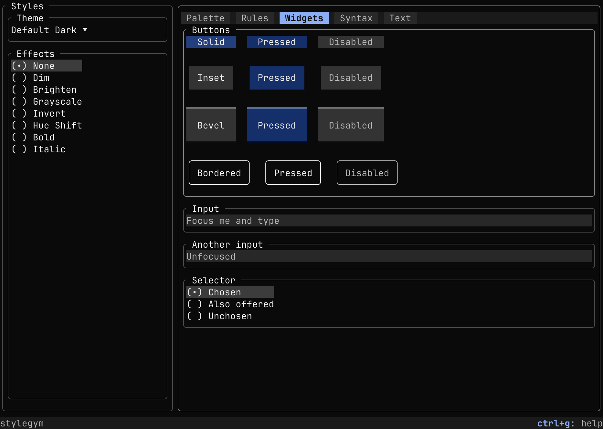
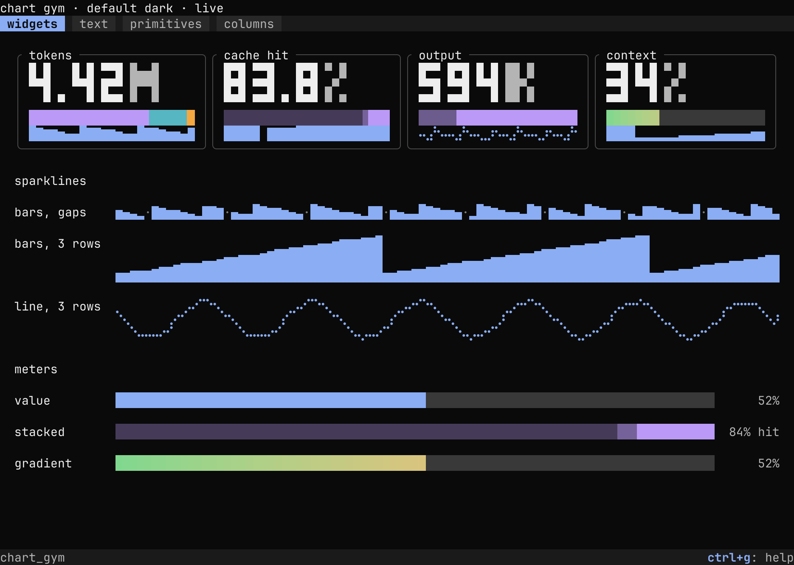
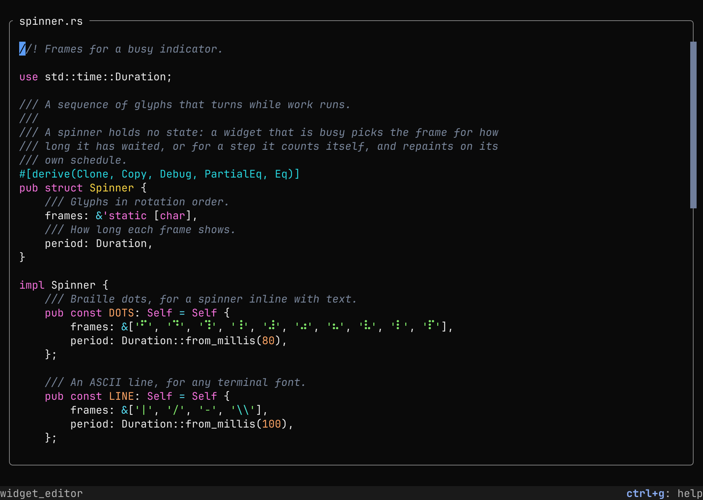
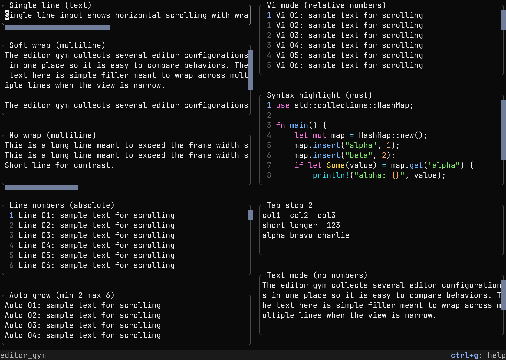
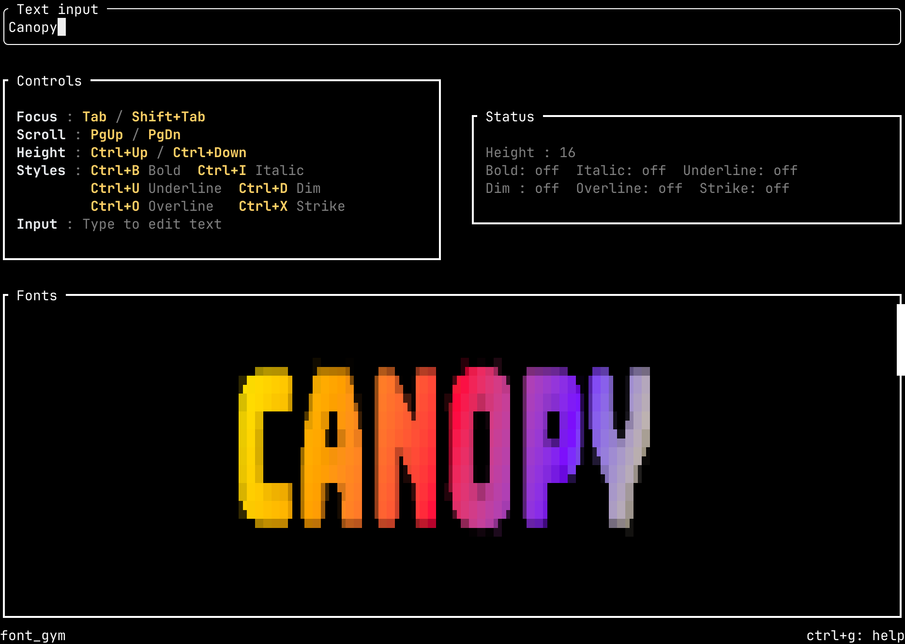
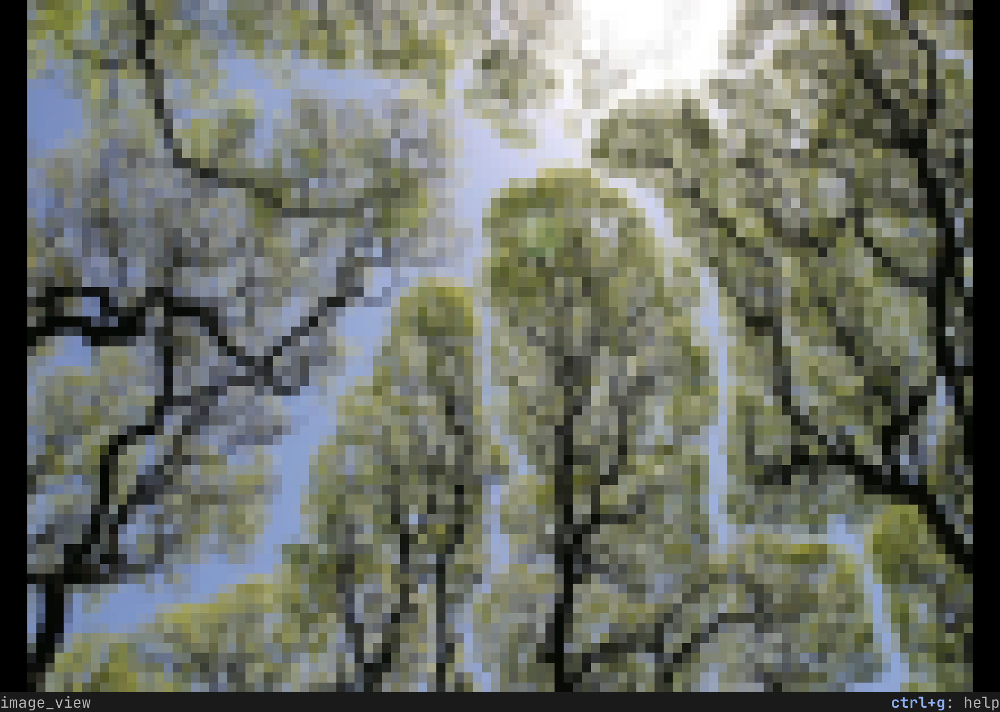
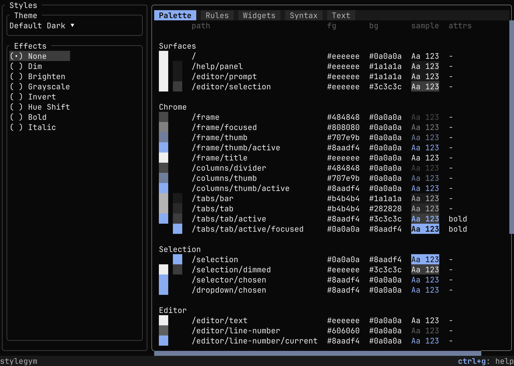
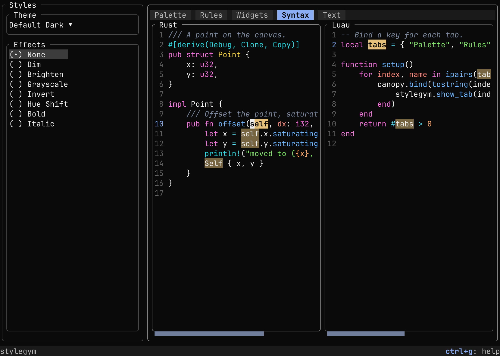

[](https://github.com/cortesi/canopy/actions/workflows/ci.yml)


**Hey curious person - if you've stumbled onto this project, please know that Canopy is not yet ready for human
consumption. I'll announce a release as soon as I feel it's worth anyone else's time.**

<center>
    
</center>


# Canopy: a terminal UI library for Rust

In a forest each tree spreads its branches wide to maximise access to sunlight, but also carefully avoids touching the
foliage of its neighbours. This phenomenon is called "crown shyness" - the forest canopy becomes an organic tiling of
the sky.

**Canopy** works just the same, but in your terminal. Interface elements are arranged in an ordered tree, with each node
managing only its children, who manage their own children in turn, until the leaf nodes tile the screen without overlap.
All interface operations are defined cleanly as traversals of this node tree.


# Widgets

Canopy draws these screenshots itself, from the gyms. `cargo xtask gallery`
captures them again: each script in `examples/gyms/gallery` drives its gym and
returns `canopy.capture()` frames, and `canopyctl gallery` draws them as PNG
images in [`docs/gallery`](./docs/gallery), beside a viewer.

<table>
    <tr>
        <td align="center" width="50%">
            
            <p><b>Stock widgets</b>: Buttons in each look and state, inputs, a selector, and a dropdown.</p>
        </td>
        <td align="center" width="50%">
            
            <p><b>Charts</b>: Big numbers, meters, sparklines, and column charts.</p>
        </td>
    </tr>
    <tr>
        <td align="center" width="50%">
            
            <p><b>Code editor</b>: A source file with syntax colours and vi keys.</p>
        </td>
        <td align="center" width="50%">
            
            <p><b>Editor</b>: The editor in each mode: wrapping, line numbers, tab stops, and auto grow.</p>
        </td>
    </tr>
    <tr>
        <td align="center" width="50%">
            
            <p><b>Font banners</b>: TrueType fonts drawn as large text for banners and headers.</p>
        </td>
        <td align="center" width="50%">
            
            <p><b>Image viewer</b>: An image drawn in the terminal.</p>
        </td>
    </tr>
    <tr>
        <td align="center" width="50%">
            
            <p><b>Themes</b>: The palette of a theme, and the roles that its rules colour.</p>
        </td>
        <td align="center" width="50%">
            
            <p><b>Syntax</b>: Code in the syntax colours of the theme.</p>
        </td>
    </tr>
</table>


# Documentation

- [Getting started](./docs/getting-started.md)
- [Architecture](./docs/architecture.md)
- [Scripting](./docs/scripting.md)
- [Agent loop](./docs/agent-loop.md)
- [Fixtures](./docs/fixtures.md)
- [Stock widget styles](./docs/styles.md)


# Demos

The gyms exercise each widget family. Run one by name:

```sh
cargo run -p gyms -- stylegym
```

Run `cargo run -p gyms -- --help` to list them. Like `examples/hello` and
`examples/todo`, the gyms launch through `canopy_mcp::launch`, so
`canopyctl` drives them: `--headless` serves MCP over stdio, and
`examples/gyms/.canopyctl.toml` points the smoke suite at the list gym.
