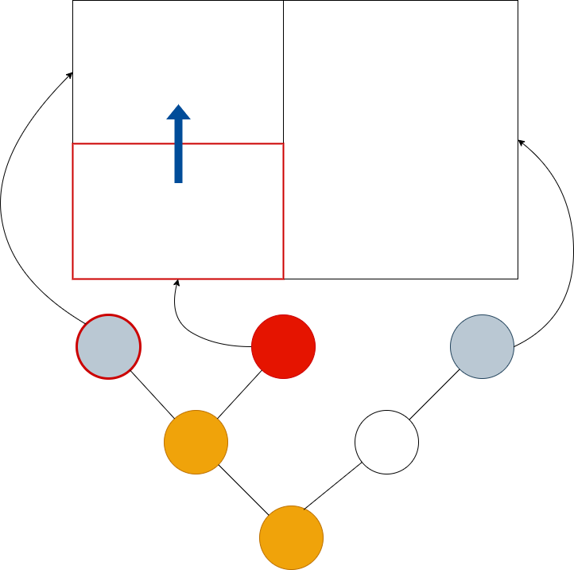
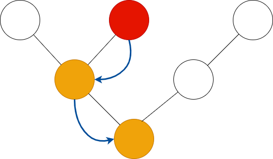

**Hey curious person - if you've stumbled onto this project, please know that
Canopy is is not yet ready for human consumption! I'll announce a release as
soon as I feel it's worth anyone else's time.**

    

# Canopy: a terminal UI library for Rust

In some forests, each tree spreads its branches wide to maximise access to
sunlight, but also carefully avoids touching the foliage of its neighbours. This
phenomenon is called "crown shyness" - the forest canopy becomes an organic
tiling of the sky.

**Canopy** works just the same, but in your terminal. Interface elements are
arranged in an ordered tree, with each node managing only its children, who
manage their own children in turn, until the leaf nodes tile the screen without
overlap. All interface operations are defined cleanly as traversals of this node
tree.

## Concepts

### Nodes

### Rendering

Rust is fast, and terminals are slow. The key to performance is to send as few
operations to the terminal as possible. Canopy uses a mark-and-sweep mechanism
to redraw only what's needed. Nodes that need rendering are tainted using the
**taint** or **taint_tree** functions. Nodes are automatically tainted if they
handle an event or if their focus status changes.

Rendering is a pre-order traversal of the tree with the **render** method called
on each tainted node.

### Focus

Eactly one node has **focus** at any one time. If a node has focus, its
ancestors up to the root of the tree are on the **focus path**. A corollary of
this is that the root node is always on the focus path. Nodes advertise whether
they can accept focus by implementing the **can_focus** method of the **Node**
trait - any node can accept focus, even if it's not a leaf.

Canopy provides various functions for controlling the focus in a subtree. These are
usually used from event handlers, letting a node control the focus location in
the subtree below it.

    

        
        
focus::next

    

    

        
        
focus::prev

    

The **focus::next** and **focus::prev** functions set focus to the next and
previous nodes that accept focus in the pre-order traversal of the tree. In the
images above, the grey nodes accept focus, and the red arrow shows where focus
will move with respect to the pre-order traversal.

    

        
        
focus::up

    

    

        
        
focus::right

    

Canopy also has the spatial focus functions **focus::{up,down,left,right}**.
These functions take the screen area of the currently focused node, then search
for nodes that accept focus in the specified direction to choose the new focus.

When a node's focus status changes, it is automatically tainted for rendering in the next sweep.

### Key Events

Key events are passed down from the current focus to the root, with the
**Node::handle_key** method called on each node. Keys are only handled once - we
stop passing the event along once the first node indicates that it's been
handled. Handling a key event automatically taints the node, unless the
**EventResult::no_render** flag in the response object is true.

### Mouse Events

Mouse events are independent of the focus - we locate the leaf node that is
under the mouse cursor, then pass event through the path from the leaf to the
root for handling. For each node on the path, the **Node::handle_mouse** method
is called, and we stop after the first node handles the event. Handling a mouse
event taints the node, unless the **EventResult::no_render** flag on the
response object is true.

### Actions

## Tick

The interval between tick events is specified when the event loop is started.
Tick events are propagated as a pre-order traversal from the root of the tree,
with the **Node::handle_tick** method called on each node. Because tick events
can fire many times a second - efficiency is quite important. A tick handler can
set the **skip** flag on its return value to signal that its children don't need
to recieve the tick event. In the diagram above, the grey node has done this, so
the traversal continues to a sibling.

Nodes that handle a tick event are automatically tainted.

### Cursor management

For historical reasons, terminals don't distinguish between the location of the
visible cursor and the draw location for rendering. Drawing with the cursor
turned on will result in a visible cursor moving over the screen. Canopy manages
this by turning cursors off during rendering, and then enabling the cursor
during a separate cursor sweep afterwards. The cursor sweep gives all nodes on
the focus path the opportunity to define a cursor location and style using the
`cursor` method on the Node trait.

