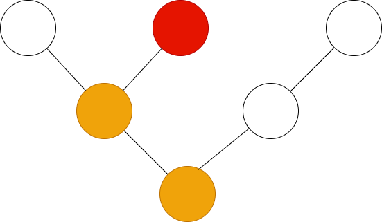
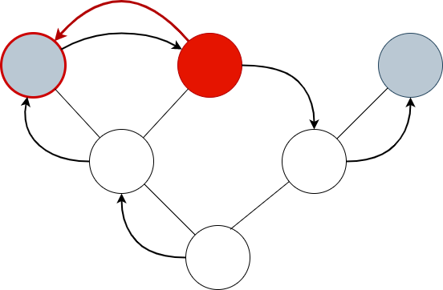
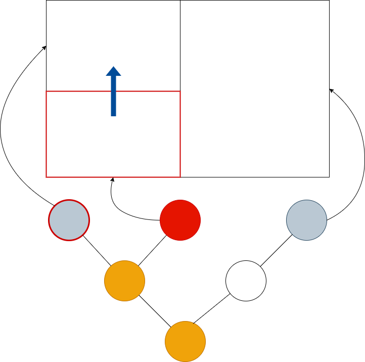

# Focus

Eactly one node has **focus** at any one time. If a node has focus, its
ancestors up to the root of the tree are on the **focus path**. A corollary of
this is that the root node is always on the focus path. Nodes advertise whether
they can accept focus by implementing the **can_focus** method of the **Node**
trait - any node can accept focus, even if it's not a leaf.

Canopy provides various functions for controlling the focus in a subtree. These are
usually used from event handlers, letting a node control the focus location in
the subtree below it.

    

        
        
focus::next

    

    

        
        
focus::prev

    

The **focus::next** and **focus::prev** functions set focus to the next and
previous nodes that accept focus in the pre-order traversal of the tree. In the
images above, the grey nodes accept focus, and the red arrow shows where focus
will move with respect to the pre-order traversal.

    

        
        
focus::up

    

    

        
        
focus::right

    

Canopy also has the spatial focus functions **focus::{up,down,left,right}**.
These functions take the screen area of the currently focused node, then search
for nodes that accept focus in the specified direction to choose the new focus.

When a node's focus status changes, it is automatically tainted for rendering in the next sweep.
