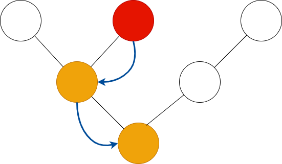

# Keyboard

Key events are passed down from the current focus to the root, with the
**Node::handle_key** method called on each node. Keys are only handled once - we
stop passing the event along once the first node indicates that it's been
handled. Handling a key event automatically taints the node, unless the
**EventResult::no_render** flag in the response object is true.
