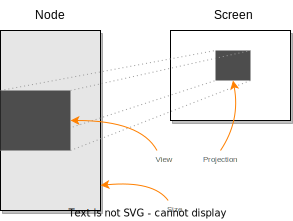

# Layout

Layout is probably the most complex part of Canopy, and understanding the principles behind it will make writing
powerful widgets much easier.

## Viewport

The core structure managing layout in Canopy is the [ViewPort](doc/canopy/viewport/struct.Viewport.html). Each node has
one, kept in the assocaited node state.

    

The **ViewPort** co-ordinates 3 different values - the virtual **size** of the node, a **view** into the content of the
node, and a **projection** of the view onto the screen. To make this concrete, let's imagine a text widget. We calculate
the **size** of the widget by wrapping the text to a given width - the height of the node is then the number of
resulting lines. The resulting size might not all fit on screen. The **view** is a window onto the widget that does fit
on screen, constrained to fall within the node's total **size**. Finally, location on the physical screen to which the
view is painted is the **projection**. Because the **projection** is always the same size as the **view**, we represent
it internally as the top left point of the projection rectangle.

The **size** and **view** are controlled by the node itself, while the **projection** is controlled by the parent node.

## Fit

## Rendering

