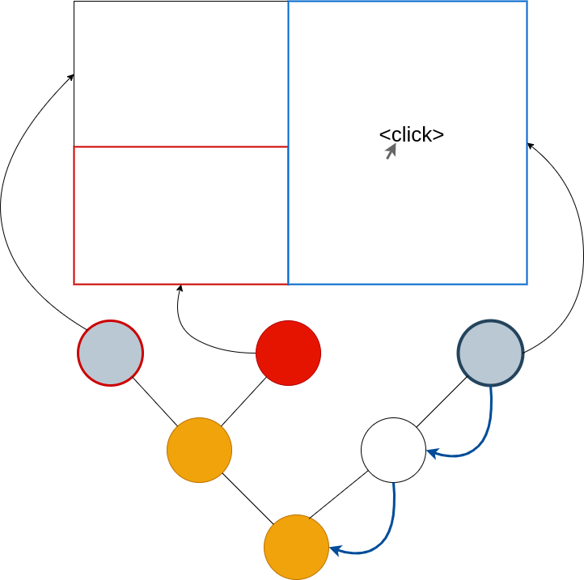

# Mouse

Mouse events are independent of the focus - we locate the leaf node that is
under the mouse cursor, then pass event through the path from the leaf to the
root for handling. For each node on the path, the **Node::handle_mouse** method
is called, and we stop after the first node handles the event. Handling a mouse
event taints the node unless the handler returns `EventOutcome::Consume`.
