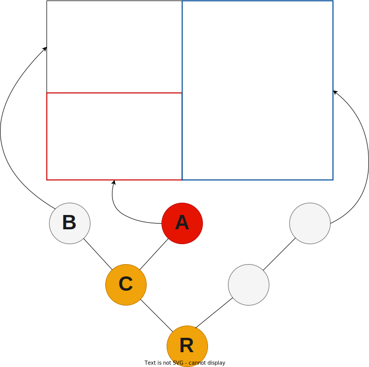
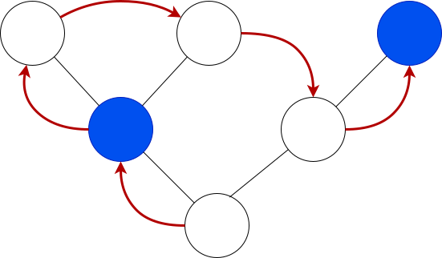

# Canopy: a terminal UI library for Rust

In a forest each tree spreads its branches wide to maximise access to sunlight, but also carefully avoids touching the
foliage of its neighbours. This phenomenon is called "crown shyness" - the forest canopy becomes an organic tiling of
the sky.

**Canopy** works just the same, but in your terminal. Interface elements are arranged in an ordered tree, with each node
managing only its children, who manage their own children in turn, until the leaf nodes tile the screen without overlap.
All interface operations are defined cleanly as traversals of this node tree.

### Structure

    

Here we have a visualization of a node tree, and the corresponding terminal output. In this image, **R** is the
[Root](doc/canopy/struct.Root.html) - a special node provided by Canopy. It exposes a set of standard commands (for
example to change focus or quit the application) and also manages utilities like the Inspector the context sensitive
help system. **C** is an an internal node - it doesn't display anything itself, but manages the size and location of
**A** and **B** within the area it's responsible for. In this example, the **A** has focus, which means that nodes **C**
and **R** are on the focus path. We'll talk more about focus management and how focus affects event handling later.

Canopy strictly enforces the node hierarchy. No node is able to draw outside of its allocated area - the co-ordinate
system used to draw to screen is relative to the node's own area.

### Rendering

Rust is fast, and terminals are slow. The key to performance is to send as few
operations to the terminal as possible. Canopy uses a mark-and-sweep mechanism
to redraw only what's needed. Nodes that need rendering are tainted using the
**taint** or **taint_tree** functions. Nodes are automatically tainted if they
handle an event or if their focus status changes.

Rendering is a pre-order traversal of the tree with the **render** method called
on each tainted node.

### Key Events

Key events are passed down from the current focus to the root, with the
**Node::handle_key** method called on each node. Keys are only handled once - we
stop passing the event along once the first node indicates that it's been
handled. Handling a key event automatically taints the node, unless the
**EventResult::no_render** flag in the response object is true.

### Mouse Events

Mouse events are independent of the focus - we locate the leaf node that is
under the mouse cursor, then pass event through the path from the leaf to the
root for handling. For each node on the path, the **Node::handle_mouse** method
is called, and we stop after the first node handles the event. Handling a mouse
event taints the node, unless the **EventResult::no_render** flag on the
response object is true.

### Actions

### Cursor management

For historical reasons, terminals don't distinguish between the location of the
visible cursor and the draw location for rendering. Drawing with the cursor
turned on will result in a visible cursor moving over the screen. Canopy manages
this by turning cursors off during rendering, and then enabling the cursor
during a separate cursor sweep afterwards. The cursor sweep gives all nodes on
the focus path the opportunity to define a cursor location and style using the
`cursor` method on the Node trait.